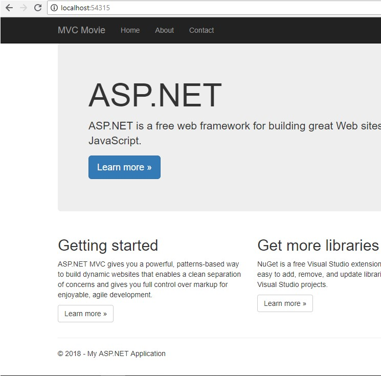
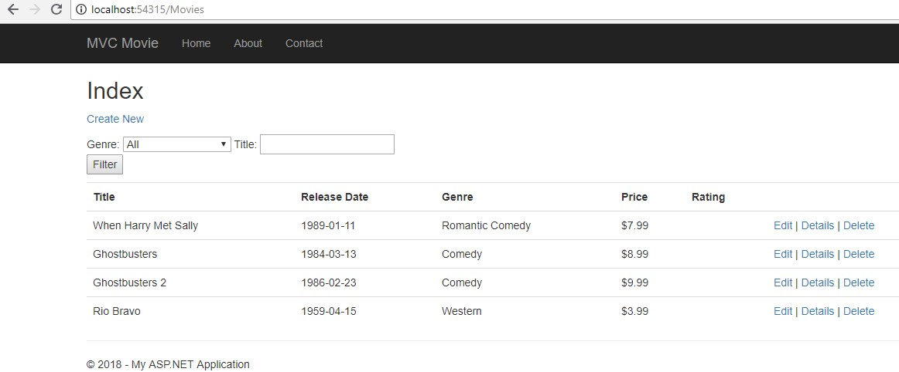

# MVCMovieNET

This project was built using ASP.NET 4.6. The design was to essentially replicate the MVC Movie lab, with an older framework to get an idea of how to use legacy codebases, as not every organization using .NET will be employing .NET Core.

## How to Use

In order to use this project, a user will require Visual Studio 2017. Since the requirment for the lab was not to include a deployed site, there is no live URL for a user to navigate to. Therefore, the user will have to clone the repo from this directory:

https://github.com/jaatay/MVCMovieNET

Once the repo is cloned, the user will navigate and run the program from the progam.cs file inside the solution folder. 

Note: this will initialize the program and run the DbContext migrations that come in the files. This will in turn create a local database and seed it. Therefore, if for some reason a user does not have the ability to use an SQL database with Visual Studio, they will have to fix that before running this program or an exception will be thrown during build

Once the program is built, the user will be taken to the landing page.

For this application, the only link that matters is the MVC Movie link in the upper left hand corner. The rest of the links are set to the defaults when the app was initialized. A user can clink on the link directly or navigate through the URL in the address bar:

http://localhost:(yourlocalhost)/Movies

Once the user navigates to the URL they are taken to the movie list. This list is generated via the DbContext seed data. By seeing this list it is validated that the user has created a local database for the project, and the seed file was successful.

Once on the list page, the user can choose any of the CRUD options to create a new movie, view details on a particular movie, search and update various entries.

##Licensing

This project uses a MIT license.
